# Credit Card Defaults Prediction

This project explores a dataset of 30,000 credit card clients from a retail bank in Taiwan, combining customer profiles, credit limits, and detailed repayment behavior in a span of 6 months. Using 23 features, including demographics, payment history, bill statements, and prior repayments, we model the probability of default for the next month. 

Building on prior research focused on predictive accuracy (link [here](https://archive.ics.uci.edu/dataset/350/default+of+credit+card+clients)), this project compares **Logistic Regression**, **Decision Tree**, and **XGBoost** using **AUC** and **confusion matrices** to evaluate how well each model distinguishes between good and bad customers, with particular attention to false negatives (missed defaulters).

Based on model performance and interpretability, a Decision Tree is selected to drive business decisions. The model outputs are then translated into a practical credit strategy, including risk-based approval thresholds, quantification of value at risk, and assessment of lost opportunity from declined but creditworthy applicants.

## Overview

This dataset contains 23 features and 1 target. 

| Name | Role | Type | Units | Description |
| --- | --- | --- | --- | --- |
| **ID** | Identifier | Integer | - | Unique ID for each customer. No inherent meaning beyond identification. |
| **LIMIT_BAL (X1)** | Feature | Integer | NT dollars | Credit limit of the customer’s card. Higher value → bigger credit line. |
| **SEX (X2)** | Feature | Integer | - | Gender of the customer: `1 = male`, `2 = female`. |
| **EDUCATION (X3)** | Feature | Integer | - | Education level: typically `1 = graduate school`, `2 = university`, `3 = high school`, `4 = others`. |
| **MARRIAGE (X4)** | Feature | Integer | - | Marital status: `1 = married`, `2 = single`, `3 = others`. |
| **AGE (X5)** | Feature | Integer | years | Age of the customer. |
| **PAY_0 (X6)** | Feature | Integer | - | Repayment status for **September** (latest month). Codes: `-1 = pay duly`, `0 = use revolving credit, paid in full`, `1 = payment delay 1 month`, `2 = payment delay 2 months`, etc. `9 = payment delay 9 months and above`|
| **PAY_2 (X7)** | Feature | Integer | - | Repayment status for **August** (one month earlier). Same coding as PAY_0. |
| **PAY_3 (X8)** | Feature | Integer | - | Repayment status for **July**. |
| **PAY_4 (X9)** | Feature | Integer | - | Repayment status for **June**. |
| **PAY_5 (X10)** | Feature | Integer | - | Repayment status for **May**. |
| **PAY_6 (X11)** | Feature | Integer | - | Repayment status for **April**. |
| **BILL_AMT1 (X12)** | Feature | Integer | NT dollars | Amount of bill statement in **September**. Shows outstanding balance. |
| **BILL_AMT2 (X13)** | Feature | Integer | NT dollars | Bill amount for **August**. |
| **BILL_AMT3 (X14)** | Feature | Integer | NT dollars | Bill amount for **July**. |
| **BILL_AMT4 (X15)** | Feature | Integer | NT dollars | Bill amount for **June**. |
| **BILL_AMT5 (X16)** | Feature | Integer | NT dollars | Bill amount for **May**. |
| **BILL_AMT6 (X17)** | Feature | Integer | NT dollars | Bill amount for **April**. |
| **PAY_AMT1 (X18)** | Feature | Integer | NT dollars | Amount paid in **September**. Shows repayment value. |
| **PAY_AMT2 (X19)** | Feature | Integer | NT dollars | Amount paid in **August**. |
| **PAY_AMT3 (X20)** | Feature | Integer | NT dollars | Amount paid in **July**. |
| **PAY_AMT4 (X21)** | Feature | Integer | NT dollars | Amount paid in **June**. |
| **PAY_AMT5 (X22)** | Feature | Integer | NT dollars | Amount paid in **May**. |
| **PAY_AMT6 (X23)** | Feature | Integer | NT dollars | Amount paid in **April**. |
| **Y** | Target | Binary | NT dollars | Default payment next month. 0 = No, 1 = yes |

## Data Set

The data set for this project is available in [.csv file](https://github.com/chenny-l/credit-cards-defaults/blob/main/datasets/credit_default_clients.csv). 

The full detailed analysis is available in [jupyter notebook](https://github.com/chenny-l/credit-cards-defaults/blob/main/notebooks/credit_card_default_prediction.ipynb).

## Preliminary Analysis

We noticed that the dataset is imbalanced, with non-defaults accounting for approximately 78% and defaults around 22%. This imbalance could bias the logistic regression model, as the majority class may dominate the learning process. We will take this into consideration during modeling later.

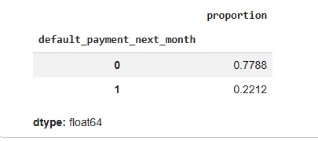

## Feature Importance

Although 23 features are not too many, and we are likely to include them all in the model, we would like to explore the predictive power of each variable with Random Forest Classifier: 

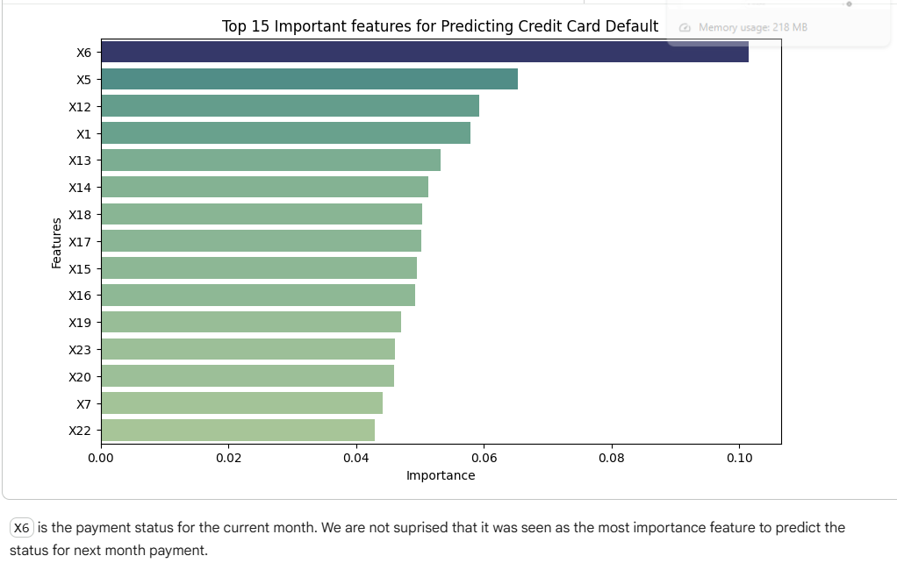

## Model Development & Validation 

We fit Logistic Regression, Decision Tree, and XGBoost models. For Logistic Regression, all features were standardized prior to model training.

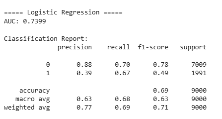 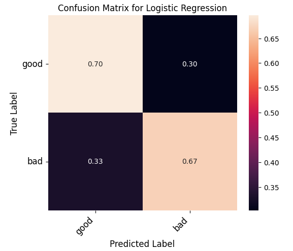 

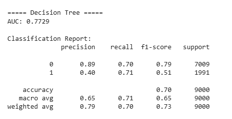 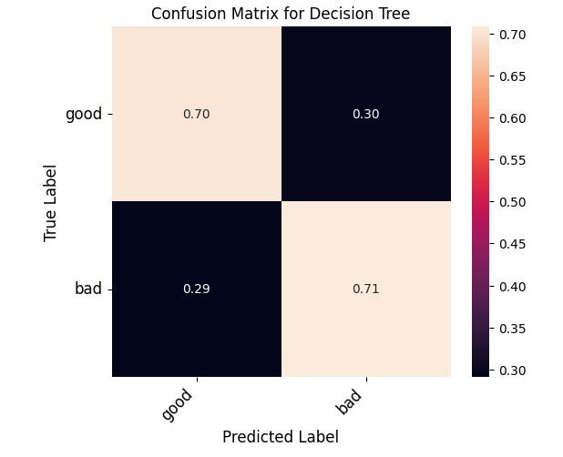 

We compared models using AUC and false negative rate. The Decision Tree outperformed Logistic Regression, leading to a lower false negative rate (0.29 vs. 0.33) and a higher AUC (0.77 vs. 0.73).

## Credit Card Strategy 

We define the ***risk thresholds** as follows: 

| Risk Tier    | Probability of Default | Action                                      |
| ------------ | ---------------------- | ------------------------------------------- |
| Low risk     | < 20%             | Approve automatically                       |
| Medium risk  | 20-50%              | Require second review / manual verification |
| High risk    | 50-70%               | Offer lower credit limit          |
| Extreme risk | > 70%               | Decline automatically                       |

The target `default_payment_next_month` for 30,000 customers are known. We will use decision trees to estimate the probability of default for each customer. By comparing predictions to the actual outcomes, we can quantify:
- **Risk**: How many approved customers actually defaulted, and hence how much loan value is at risk? 

- **Lost Opportunity**: how many declined customers would have been safe?

We added a new column `action` to the dataset, applying Decision Tree predictions with predefined risk thresholds to simulate real-world approval decisions:

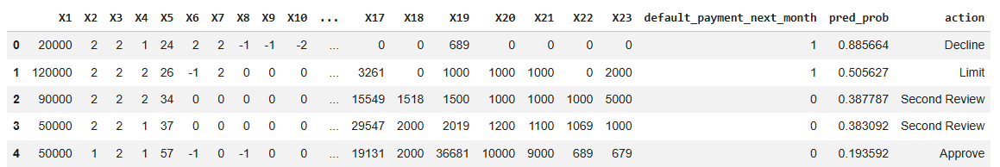

If we plot the default rate by action, we can see the default rate is highest in the `decline` action, which is what we would like to see. The second highest is `Offering lower credit limit`, and then `Second review`, the lowest default rate is in `approve` action. This result aligns with the ordering of the risk thresholds, as expected.

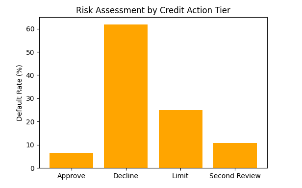

We also calculated the value at risk and lost opportunity in the [notebook](https://github.com/chenny-l/credit-cards-defaults/blob/main/notebooks/credit_card_default_prediction.ipynb). 

Risk comes from the exposure from customers who were approved but defaulted, while lost opportunity represents the value of credit declined for customers who would not have defaulted.

Building on the predicted probability of default, we can construct a scorecard that maps risk into score bands, identifying approval or decline decisions based on each customer’s score band.

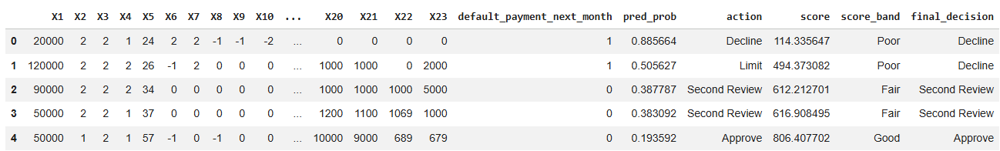

We then can calculate the default at risk according to this decision. 

## Stress Testing

We want to consider a few additional features before stress testing: 

Before stress testing, we developed some signals as following:

- **Credit unitilization** = bill amount / total credit balance

  High utilization could mean more financial stress.

- **Payment ratio** = payment amount / bill amount

  This signals the customer's ability to pay.

- **Avg Deliquency score** = mean(PAY_0, PAY_2, PAY_3, PAY_4, PAY_5, PAY_6)

  This calculates the average length of deliquency for the customer in the 6 months.

- **Balance growth** = bill amount (in September) - bill amount (in September)

  Detects if a customer's debt is increasing / decreaing from the past 6 months. Positive value indicates that the customer is spending more and not paying enough; negative value means the customer spending less or paying down the debt, suggesting healthy financial behaviour.

One of the scenaios that could happen is **Inflation**: when encountering inflation, prices are higher and the purchasing value of money will fall. It likely causes customers rely more heavily on the credit card, and slow the repayment behaviour. We set the **credit utilization** to be up about 20%, **payment amount** down 10% and takes about 1 month longer for a customer to fully clear a balance.

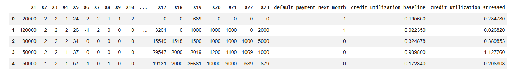

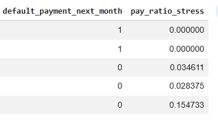

And with longer payment cycle, we fit the decision tree model to the stressed data. 

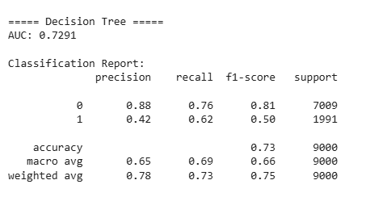

The Decision Tree model under the stressed scenario correctly identified 76% of good customers and 62% of defaulters, compared to the baseline model, which captured 70% of good customers and 71% of defaulters. While the stressed model performs better at identifying good customers, it misses some defaulters, misclassifying them as low-risk. As shown in the following bar graph, the baseline model predicts higher PD values overall, whereas the stressed model somewhat unexpectedly predicted 568 additional non-defaulters as low-risk.

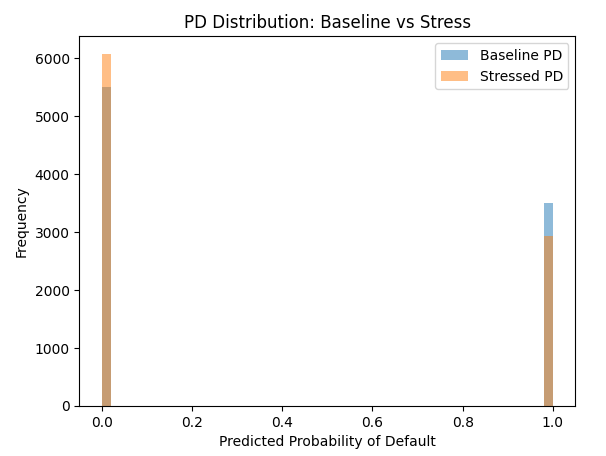

## Future Discussion 

We would like to mention a few limitations for future improvements:

- Static prediction horizon: The model predicts only next-month default due to data constraints. In practice, credit risk evolves over time; incorporating time series analysis would enable tracking behavioral trends across risk segments.

- Class imbalance: With defaults at ~22%, the model may be biased toward non-defaults, potentially underestimating high-risk customers.

- Risk threshold: Approval cutoffs should be aligned with business objectives, balancing profitability and risk appetite.

- Model interpretability: More complex models (e.g., XGBoost) can be harder to explain to stakeholders, limiting their practical adoption.

- Monitoring framework: A dashboard tracking customer behavior shifts and macroeconomic indicators (e.g., housing prices, GDP, unemployment) would strengthen ongoing risk management.

- Enhanced risk metrics: Extend beyond Value at Risk by incorporating Expected Loss (EL = PD × LGD × EAD) for a more comprehensive risk assessment.

